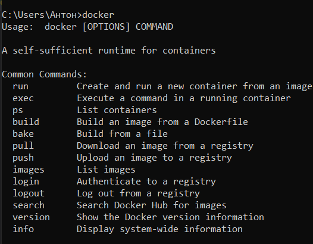
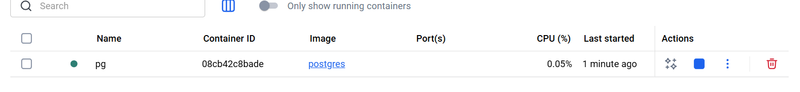
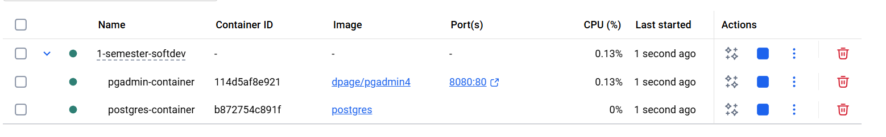
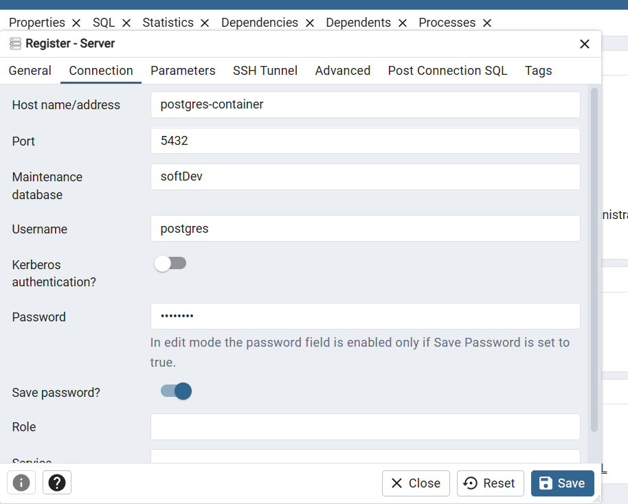
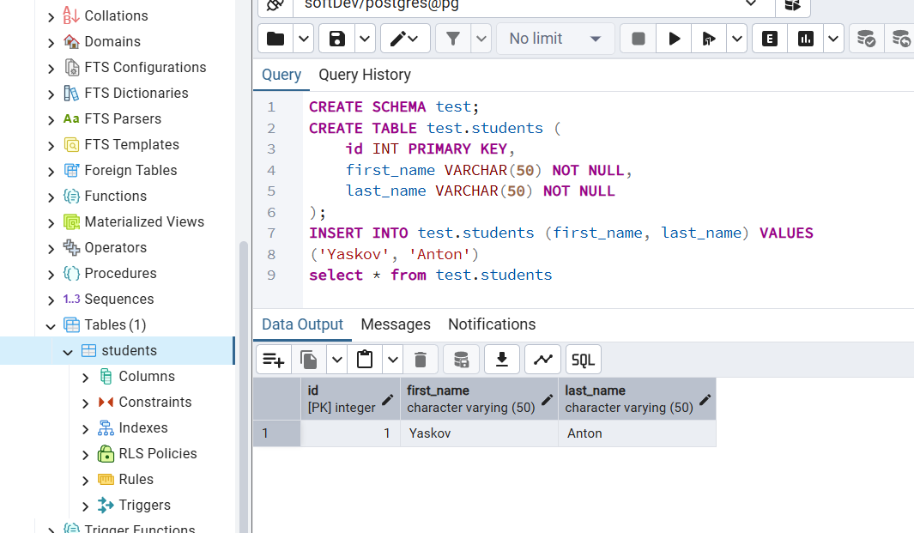

# 1.Установить и проверить работу Docker

Скачал `Docker desktop`. Проверил с помощью команды `docker` в консоль


# 2.Изучить базовые команды Docker

Изучил список команд со скриншота выше. Выделю основные.

Для взаимодействия с образами:
```bash
docker pull {image} - Скачать образ
docker push {image} - Отправить образ в registry
docker build -t {image-name} -f {path-to-Dockerfile} - собрать образ
docker images - Список образов
```
Для взаимодействия с контейнерами:
```bash
docker run {image} - Запустить контейнер с образом 
docker ps - Список контейнеров
docker stop {container} - Остановить контейнер
docker start {container} - Запустить остановленный контейнер
docker restart {container} - Перезапустить контейнер
docker rm {container} - Удалить остановленный контейнер
```

# 3.Запустить контейнер с PostgreSQL в изолированном режиме

Запускаю с помощью команды
`docker run -d --name pg -e POSTGRES_USER=postgres -e POSTGRES_PASSWORD=password -e POSTGRES_DB=softDev postgres`
Проверяю, что у него не открыты порты в `Docker desktop`


# 4.Запустить контейнер с pgAdmin и подключить его к контейнеру с БД через сеть Docker

Можно отдельно всё создавать по частям, но я воспользуюсь docker-compose, в котором опишу всю систему сразу.

<details>
    <summary>docker-compose</summary>

```docker
services:
  postgres:
    image: postgres
    container_name: postgres-container
    environment:
      POSTGRES_USER: postgres
      POSTGRES_PASSWORD: password
      POSTGRES_DB: softDev
    networks:
      - pg-network

  pgadmin:
    image: dpage/pgadmin4
    container_name: pgadmin-container
    environment:
      PGADMIN_DEFAULT_EMAIL: p@p.p
      PGADMIN_DEFAULT_PASSWORD: password
    ports:
      - "8080:80"
    networks:
      - pg-network
    depends_on:
      - postgres

networks:
  pg-network:
    driver: bridge
```
</details>

Запускаю docker-compose командой `docker compose -f docker-compose_4.yaml up`

Проверяю работоспособность


# 5. Подключиться к БД из pgAdmin, создать схему и выполнить запросы

Захожу в `pgAdmin` по его порту `8080`, вхожу по данным которые указал в `docker-compose`.

Регистрирую новый сервер со следующими параметрами подключения:


Создаю схему, выполняю запросы


# 6. Обеспечить сохранность данных БД с помощью томов Docker.

Для этого нужно добавить `volumes` в `docker-compose`.

Также, добавлю файл `.env` и вынесу туда переменные окружения. В файле буду использовать их в виде `${ENV_VAR}`

<details>
<summary>Итоговый docker-compose с volumes</summary>

```docker
services:
  postgres:
    image: postgres
    container_name: postgres-container
    environment:
      POSTGRES_USER: $POSTGRES_USER
      POSTGRES_PASSWORD: $POSTGRES_PASSWORD
      POSTGRES_DB: $POSTGRES_DB
    networks:
      - pg-network
    volumes:
      - postgres_data:/var/lib/postgresql/data <-- Нужно добавить сюда

  pgadmin:
    image: dpage/pgadmin4
    container_name: pgadmin-container
    environment:
      PGADMIN_DEFAULT_EMAIL: $PGADMIN_DEFAULT_EMAIL
      PGADMIN_DEFAULT_PASSWORD: $PGADMIN_DEFAULT_PASSWORD
    ports:
      - "8080:80"
    networks:
      - pg-network
    depends_on:
      - postgres

networks:
  pg-network:
    driver: bridge

volumes: 
  postgres_data: <-- И сюда
```

</details>